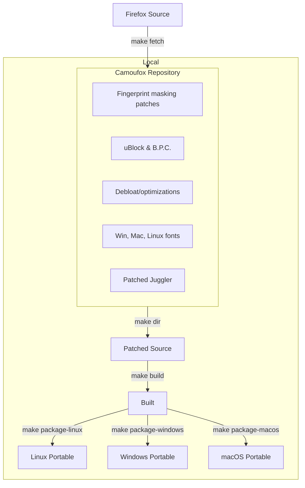
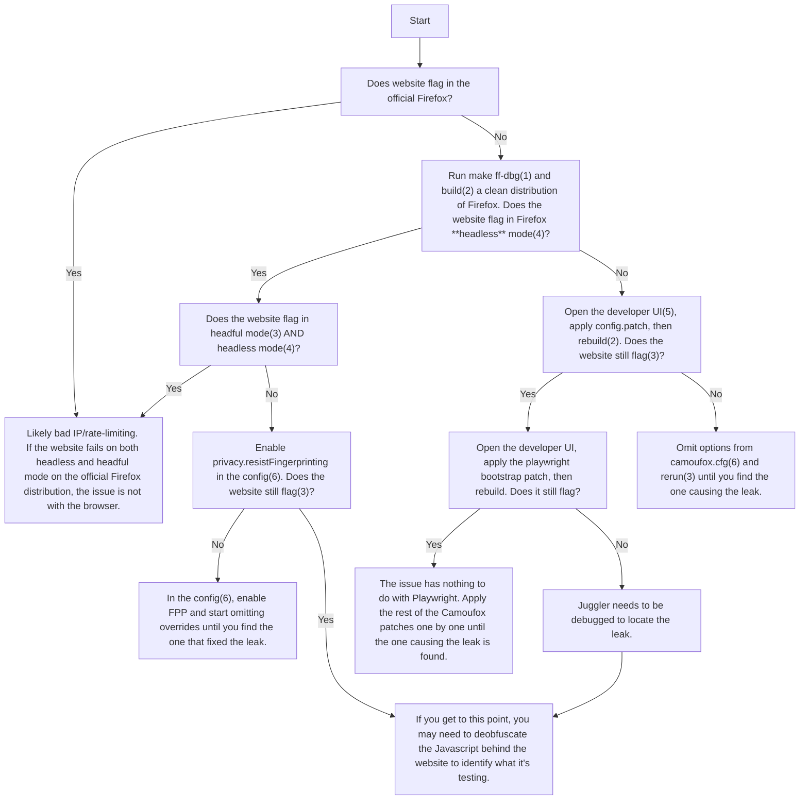

<h1 align="center">Camoufox</h1>

<h4 align="center">A stealthy, minimalistic, custom build of Firefox for web scraping 🦊</h4>

<p align="center">
Camoufox is an open source anti-detect browser for robust fingerprint injection & anti-bot evasion.
</p>

<p align="center">
  <a href="https://trendshift.io/repositories/12224" target="_blank">
  </a>
</p>

---

> [!IMPORTANT]
>
> ## About This Fork
>
> The original maintainer [@daijro](https://github.com/daijro) is recovering from a medical emergency (hospitalized since March 2025).
>
> When the original maintainer returns, this work will be contributed back upstream. In the meantime, this fork provides newer Firefox builds.
>
> ❤️ **Wishing @daijro a full recovery.**

---

> [!NOTE]
> The documentation for upstream is available at [camoufox.com](https://camoufox.com).

Camoufox is the most modern, effective & future-proof open source solution for avoiding bot detection and intelligent fingerprint rotation. It outperforms most commercial anti-bot browsers.

## Features

- Invisible to **all anti-bot systems** 🎭
  - Camoufox performs better than most commercial anti-bot browsers.

* Fingerprint injection & rotation (without JS injection!)
  - All navigator properties (device, OS, hardware, browser, etc.) ✅
  - Screen size, resolution, window, & viewport properties ✅
  - Geolocation, timezone, & locale spoofing ✅
  - Font spoofing & anti-fingerprinting ✅
  - WebGL parameters, supported extensions, context attributes, & shader precision formats ✅
  - WebRTC IP spoofing at the protocol level ✅
  - Media devices, voices, speech playback rate, etc. ✅
  - And much, much more!

- Quality of life features
  - Human-like mouse movement 🖱️
  - Blocks & circumvents ads 🛡️
  - No CSS animations 💨

* Debloated & optimized for memory efficiency ⚡
* [PyPi package](https://pypi.org/project/camoufox/) for updates & auto fingerprint injection 📦
* Stays up to date with the latest Firefox version 🕓
* Easy branding configuration for forks & stealth (see [BRANDING.md](docs/BRANDING.md)) 🏷️

---

## Fingerprint Injection

In Camoufox, data is intercepted at the C++ implementation level, making the changes undetectable through JavaScript inspection.

To spoof fingerprint properties, pass a JSON containing properties to spoof to the [Python interface](https://github.com/daijro/camoufox/tree/main/pythonlib#camoufox-python-interface):

```py
>>> with Camoufox(config={"property": "value"}) as browser:
```

Config data not set by the user will be automatically populated using [BrowserForge](https://github.com/daijro/browserforge) fingerprints, which mimic the statistical distribution of device characteristics in real-world traffic.

<details>
<summary>
Legacy documentation
</summary>

#### The following properties can be spoofed:

<details>
<summary>
Navigator
</summary>

Navigator properties can be fully spoofed to other Firefox fingerprints, and it is **completely safe**! However, there are some issues when spoofing Chrome (leaks noted).

| Property                       | Notes |
| ------------------------------ | ----- |
| navigator.userAgent            | ✅    |
| navigator.doNotTrack           | ✅    |
| navigator.appCodeName          | ✅    |
| navigator.appName              | ✅    |
| navigator.appVersion           | ✅    |
| navigator.oscpu                | ✅    |
| navigator.language             | ✅    |
| navigator.languages            | ✅    |
| navigator.platform             | ✅    |
| navigator.hardwareConcurrency  | ✅    |
| navigator.product              | ✅    |
| navigator.productSub           | ✅    |
| navigator.maxTouchPoints       | ✅    |
| navigator.cookieEnabled        | ✅    |
| navigator.globalPrivacyControl | ✅    |
| navigator.appVersion           | ✅    |
| navigator.buildID              | ✅    |
| navigator.doNotTrack           | ✅    |

Camoufox will automatically add the following default fonts associated your spoofed User-Agent OS (the value passed in `navigator.userAgent`).

**Notes**:

- **navigator.webdriver** is set to false at all times.
- `navigator.language` & `navigator.languages` will fall back to the `locale:language`/`locale:region` values if not set.
- When spoofing Chrome fingerprints, the following may leak:
  - navigator.userAgentData missing.
  - navigator.deviceMemory missing.
- Changing the presented Firefox version can be detected by some testing websites, but typically will not flag production WAFs.

</details>

<details>
<summary>
Cursor movement
</summary>

### Human-like Cursor movement

Camoufox has built-in support for human-like cursor movement. The natural motion algorithm was originally from [rifosnake's HumanCursor](https://github.com/riflosnake/HumanCursor), but has been rewritten in C++ and modified for more distance-aware trajectories.

### Demo

<video src="https://github.com/user-attachments/assets/6d33d6af-3537-4603-bf24-6bd3f4f8f455" width="500px" autoplay loop muted></video>

### Properties

| Property         | Supported | Description                                                         |
| ---------------- | --------- | ------------------------------------------------------------------- |
| humanize         | ✅        | Enable/disable human-like cursor movement. Defaults to False.       |
| humanize:maxTime | ✅        | Maximum time in seconds for the cursor movement. Defaults to `1.5`. |
| showcursor       | ✅        | Toggles the cursor highlighter. Defaults to True.                   |

**Notes:**

- The cursor highlighter is **not** ran in the page context. It will not be visible to the page. You don't have to worry about it leaking.

</details>

<details>
<summary>
Fonts
</summary>

### Adding Fonts

Fonts can be passed to be used in Camoufox through the `fonts` config property.

By default, Camoufox is bundled with the default Windows 11 22H2 fonts, macOS Sonma fonts, and Linux fonts used in the TOR bundle.

Camoufox will automatically add the default fonts associated your spoofed User-Agent OS (the value passed in `navigator.userAgent`):

- **Mac OS fonts** (from macOS Sonma):
- **Windows fonts** (from Windows 11 22H2):
- **Linux fonts** (from TOR Browser):

Other fonts can be added by copying them into the `fonts/` directory in Camoufox, or by installing them on your system.

**Note**: It is highly recommended that you randomly pass custom fonts to the `fonts` config property to avoid font fingerprinting!

### Font Metrics

Camoufox has a built in mechanism to prevent fingerprinting by font metrics & unicode glyphs:


This works by shifting the spacing of each letter by a random value between 0-0.1px.

</details>

<details>
<summary>
Screen
</summary>

| Property           | Status |
| ------------------ | ------ |
| screen.availHeight | ✅     |
| screen.availWidth  | ✅     |
| screen.availTop    | ✅     |
| screen.availLeft   | ✅     |
| screen.height      | ✅     |
| screen.width       | ✅     |
| screen.colorDepth  | ✅     |
| screen.pixelDepth  | ✅     |
| screen.pageXOffset | ✅     |
| screen.pageYOffset | ✅     |

**Notes:**

- `screen.colorDepth` and `screen.pixelDepth` are synonymous.

</details>

<details>
<summary>
Window
</summary>

| Property                | Status | Notes                           |
| ----------------------- | ------ | ------------------------------- |
| window.scrollMinX       | ✅     |
| window.scrollMinY       | ✅     |
| window.scrollMaxX       | ✅     |
| window.scrollMaxY       | ✅     |
| window.outerHeight      | ✅     | Sets the window height.         |
| window.outerWidth       | ✅     | Sets the window width.          |
| window.innerHeight      | ✅     | Sets the inner viewport height. |
| window.innerWidth       | ✅     | Sets the inner viewport width.  |
| window.screenX          | ✅     |
| window.screenY          | ✅     |
| window.history.length   | ✅     |
| window.devicePixelRatio | ✅     | Works, but not recommended.     |

**Notes:**

- Setting the outer window viewport will cause some cosmetic defects to the Camoufox window if the user attempts to manually resize it. Under no circumstances will Camoufox allow the outer window viewport to be resized.

</details>

<details>
<summary>
Document
</summary>

Spoofing document.body has been implemented, but it is more advicable to set `window.innerWidth` and `window.innerHeight` instead.

| Property                   | Status |
| -------------------------- | ------ |
| document.body.clientWidth  | ✅     |
| document.body.clientHeight | ✅     |
| document.body.clientTop    | ✅     |
| document.body.clientLeft   | ✅     |

</details>

<details>
<summary>
HTTP Headers
</summary>

Camoufox can override the following network headers:

| Property                | Status |
| ----------------------- | ------ |
| headers.User-Agent      | ✅     |
| headers.Accept-Language | ✅     |
| headers.Accept-Encoding | ✅     |

**Notes:**

- If `headers.User-Agent` is not set, it will fall back to `navigator.userAgent`.

</details>

<details>
<summary>
Geolocation & Intl
</summary>

| Property              | Status | Description                                                                                                                                            | Required Keys           |
| --------------------- | ------ | ------------------------------------------------------------------------------------------------------------------------------------------------------ | ----------------------- |
| geolocation:latitude  | ✅     | Latitude to use.                                                                                                                                       | `geolocation:longitude` |
| geolocation:longitude | ✅     | Longitude to use.                                                                                                                                      | `geolocation:latitude`  |
| geolocation:accuracy  | ✅     | Accuracy in meters. This will be calculated automatically using the decminal percision of `geolocation:latitude` & `geolocation:longitude` if not set. |                         |
| timezone              | ✅     | Set a custom TZ timezone (e.g. "America/Chicago"). This will also change `Date()` to return the local time.                                            |                         |
| locale:language       | ✅     | Spoof the Intl API, headers, and system language (e.g. "en")                                                                                           | `locale:region`         |
| locale:region         | ✅     | Spoof the Intl API, headers, and system region (e.g. "US").                                                                                            | `locale:language`       |
| locale:script         | ✅     | Set a custom script (e.g. "Latn"). Will be set automatically if not specified.                                                                         |                         |

The **Required Keys** are keys that must also be set for the property to work.

**Notes:**

- Location permission prompts will be accepted automatically if `geolocation:latitude` and `geolocation:longitude` are set.
- `timezone` **must** be set to a valid TZ identifier. See [here](https://en.wikipedia.org/wiki/List_of_tz_database_time_zones) for a list of valid timezones.
- `locale:language` & `locale:region` **must** be set to valid locale values. See [here](https://simplelocalize.io/data/locales/) for a list of valid locale-region values.

</details>

<details>
<summary>
WebRTC IP
</summary>

Camoufox implements WebRTC IP spoofing at the protocol level by modifying ICE candidates and SDP before they're sent.

| Property    | Status | Description         |
| ----------- | ------ | ------------------- |
| webrtc:ipv4 | ✅     | IPv4 address to use |
| webrtc:ipv6 | ✅     | IPv6 address to use |

**Notes:**

- To completely disable WebRTC, set the `media.peerconnection.enabled` preference to `false`.

</details>

<details>
<summary>
WebGL
</summary>

### WebGL in Camoufox

WebGL is disabled in Camoufox by default. To enable it, set the `webgl.disabled` Firefox preference to `false`.

WebGL being disabled typically doesn't trigger detection by WAFs, so you generally don't need to be concerned about it. Only use WebGL when it's absolutely necessary for your specific use case.

Because I don't have a dataset of WebGL fingerprints to rotate against, WebGL fingerprint rotation is not implemented in the Camoufox Python library. If you need to spoof WebGL, you can do so manually with the following properties.

### Demo site

This repository includes a demo site (see [here](https://github.com/daijro/camoufox/blob/main/scripts/examples/webgl.html)) that prints your browser's WebGL parameters. You can use this site to generate WebGL fingerprints for Camoufox from other devices.


### Properties

Camoufox supports spoofing WebGL parameters, supported extensions, context attributes, and shader precision formats.

**Note**: Do NOT randomly assign values to these properties. WAFs hash your WebGL fingerprint and compare it against a dataset. Randomly assigning values will lead to detection as an unknown device.

| Property                                        | Description                                                                                                           | Example                                                                                 |
| ----------------------------------------------- | --------------------------------------------------------------------------------------------------------------------- | --------------------------------------------------------------------------------------- |
| webGl:renderer                                  | Spoofs the name of the unmasked WebGL renderer.                                                                       | `"NVIDIA GeForce GTX 980, or similar"`                                                  |
| webGl:vendor                                    | Spoofs the name of the unmasked WebGL vendor.                                                                         | `"NVIDIA Corporation"`                                                                  |
| webGl:supportedExtensions                       | An array of supported WebGL extensions ([full list](https://registry.khronos.org/webgl/extensions/)).                 | `["ANGLE_instanced_arrays", "EXT_color_buffer_float", "EXT_disjoint_timer_query", ...]` |
| webGl2:supportedExtensions                      | The same as `webGl:supportedExtensions`, but for WebGL2.                                                              | `["ANGLE_instanced_arrays", "EXT_color_buffer_float", "EXT_disjoint_timer_query", ...]` |
| webGl:contextAttributes                         | A dictionary of WebGL context attributes.                                                                             | `{"alpha": true, "antialias": true, "depth": true, ...}`                                |
| webGl2:contextAttributes                        | The same as `webGl:contextAttributes`, but for WebGL2.                                                                | `{"alpha": true, "antialias": true, "depth": true, ...}`                                |
| webGl:parameters                                | A dictionary of WebGL parameters. Keys must be GL enums, and values are the values to spoof them as.                  | `{"2849": 1, "2884": false, "2928": [0, 1], ...}`                                       |
| webGl2:parameters                               | The same as `webGl:parameters`, but for WebGL2.                                                                       | `{"2849": 1, "2884": false, "2928": [0, 1], ...}`                                       |
| webGl:parameters:blockIfNotDefined              | If set to `true`, only the parameters in `webGl:parameters` will be allowed. Can be dangerous if not used correctly.  | `true`/`false`                                                                          |
| webGl2:parameters:blockIfNotDefined             | If set to `true`, only the parameters in `webGl2:parameters` will be allowed. Can be dangerous if not used correctly. | `true`/`false`                                                                          |
| webGl:shaderPrecisionFormats                    | A dictionary of WebGL shader precision formats. Keys are formatted as `"<shaderType>,<precisionType>"`.               | `{"35633,36336": {"rangeMin": 127, "rangeMax": 127, "precision": 23}, ...}`             |
| webGl2:shaderPrecisionFormats                   | The same as `webGL:shaderPrecisionFormats`, but for WebGL2.                                                           | `{"35633,36336": {"rangeMin": 127, "rangeMax": 127, "precision": 23}, ...}`             |
| webGl:shaderPrecisionFormats:blockIfNotDefined  | If set to `true`, only the shader percisions in `webGl:shaderPrecisionFormats` will be allowed.                       | `true`/`false`                                                                          |
| webGl2:shaderPrecisionFormats:blockIfNotDefined | If set to `true`, only the shader percisions in `webGl2:shaderPrecisionFormats` will be allowed.                      | `true`/`false`                                                                          |

</details>

<details>
<summary>
AudioContext
</summary>

Camoufox can spoof the AudioContext sample rate, output latency, and max channel count.

| Property                     | Status | Description                                |
| ---------------------------- | ------ | ------------------------------------------ |
| AudioContext:sampleRate      | ✅     | Spoofs the AudioContext sample rate.       |
| AudioContext:outputLatency   | ✅     | Spoofs the AudioContext output latency.    |
| AudioContext:maxChannelCount | ✅     | Spoofs the AudioContext max channel count. |

Here is a testing site: https://audiofingerprint.openwpm.com/

</details>

<details>
<summary>
Addons
</summary>

In the Camoufox Python library, addons can be loaded with the `addons` parameter:

```python
from camoufox.sync_api import Camoufox

with Camoufox(addons=['/path/to/addon', '/path/to/addon2']) as browser:
    page = browser.new_page()
```

Camoufox will automatically download and use the latest uBlock Origin with custom privacy/adblock filters, and B.P.C. by default to help with ad circumvention.

You can also exclude default addons with the `exclude_addons` parameter:

```python
from camoufox.sync_api import Camoufox
from camoufox import DefaultAddons

with Camoufox(exclude_addons=[DefaultAddons.UBO, DefaultAddons.BPC]) as browser:
    page = browser.new_page()
```

<details>
<summary>
Loading addons with the legacy launcher...
</summary>

Addons can be loaded with the `--addons` flag.

Example:

```bash
./launcher --addons '["/path/to/addon", "/path/to/addon2"]'
```

Camoufox will automatically download and use the latest uBlock Origin with custom privacy/adblock filters, and B.P.C. by default to help with scraping.

You can also exclude default addons with the `--exclude-addons` flag:

```bash
./launcher --exclude-addons '["uBO", "BPC"]'
```

</details>

---

</details>

<details>
<summary>
Miscellaneous (battery status, etc)
</summary>

| Property                | Status | Description                                                                                                                     |
| ----------------------- | ------ | ------------------------------------------------------------------------------------------------------------------------------- |
| pdfViewer               | ✅     | Sets navigator.pdfViewerEnabled. Please keep this on though, many websites will flag a lack of pdfViewer as a headless browser. |
| battery:charging        | ✅     | Spoofs the battery charging status.                                                                                             |
| battery:chargingTime    | ✅     | Spoofs the battery charging time.                                                                                               |
| battery:dischargingTime | ✅     | Spoofs the battery discharging time.                                                                                            |
| battery:level           | ✅     | Spoofs the battery level.                                                                                                       |

<details>
<summary>
WebSocket Port Remapping
</summary>

Camoufox automatically remaps WebSocket connection attempts to localhost fingerprinting ports, preventing timing-based port scanning attacks (like Kasada uses) that detect automation environments. Each monitored port is remapped to a unique target port to prevent timing correlation attacks.

| Property                               | Status | Description                                                         |
| -------------------------------------- | ------ | ------------------------------------------------------------------- |
| websocket:remapping:enabled            | ✅     | Enable/disable port remapping. Defaults to true.                    |
| websocket:remapping:basePort           | ✅     | Base port for auto-assignment in default mode. Defaults to 1080.    |
| websocket:remapping:manualPortMappings | ✅     | Array of `"source:target"` mappings. Replaces defaults if provided. |

**Two Operating Modes:**

1. **Default Mode** (no manual mappings configured):

   - Uses hardcoded fingerprinting port list (see below)
   - Each port auto-assigned unique sequential target starting at `basePort` (default: 1080)
   - Example: 63333→1080, 5900→1081, 5901→1082, etc.

2. **Manual Mode** (`manualPortMappings` provided):
   - User specifies explicit `"source:target"` mappings
   - Each source port must have unique target to prevent timing correlation
   - Replaces default list entirely
   - Example config:
   ```json
   {
     "websocket:remapping:manualPortMappings": [
       "9222:1080",
       "4444:1081",
       "5900:1082"
     ]
   }
   ```

**Default monitored ports** (used in default mode):

- Remote desktop: VNC (5900-5903, 5931, 5938-5939, 5944, 5950, 6039-6040), RDP (3389)
- Automation: Selenium/WebDriver (4444, 4445, 9515), Chrome DevTools (9222, 9223)
- Development: 3000, 8080, 8081, 35729
- Docker: 2375, 2376, 2377
- Proxies: 1080, 3128, 8888, 9050
- Android debugging: 5037
- Other: 63333, 5279, 7070, 2112

**Notes:**

- Only affects WebSocket connections to localhost (127.0.0.1, localhost, ::1)
- Connection attempts still occur (maintains timing), but redirected to different closed ports
- Each source port maps to unique target to prevent fingerprinting via timing correlation
- Test with: `python3 browser-tests/test-websocket-port-remapping.py`

</details>

</details>

</details>

<hr width=50>

## Patches

### What changes were made?

#### Fingerprint spoofing

- Navigator properties spoofing (device, browser, locale, etc.)
- Support for emulating screen size, resolution, etc.
- Spoof WebGL parameters, supported extensions, context attributes, and shader precision formats.
- Spoof inner and outer window viewport sizes
- Spoof AudioContext sample rate, output latency, and max channel count
- Spoof device voices & playback rates
- Network headers (Accept-Languages and User-Agent) are spoofed to match the navigator properties
- WebRTC IP spoofing at the protocol level
- Geolocation, timezone, and locale spoofing
- Battery API spoofing
- etc.

#### Stealth patches

- Avoids main world execution leaks. All page agent javascript is sandboxed
- Avoids frame execution context leaks
- Fixes `navigator.webdriver` detection
- Fixes Firefox headless detection via pointer type ([#26](https://github.com/daijro/camoufox/issues/26))
- Removed potentially leaking anti-zoom/meta viewport handling patches
- Uses non-default screen & window sizes
- Re-enable fission content isolations
- Re-enable PDF.js
- Other leaking config properties changed

#### Anti font fingerprinting

- Automatically uses the correct system fonts for your User Agent
- Bundled with Windows, Mac, and Linux system fonts
- Prevents font metrics fingerprinting by randomly offsetting letter spacing

#### Playwright support

- Custom implementation of Playwright for the latest Firefox
- Various config patches to evade bot detection

#### Debloat/Optimizations

- Stripped out/disabled _many, many_ Mozilla services. Runs faster than the original Mozilla Firefox, and uses less memory (200mb)
- Patches from LibreWolf & Ghostery to help remove telemetry & bloat
- Debloat config from PeskyFox, LibreWolf, and others
- Speed & network optimizations from FastFox
- Removed all CSS animations
- Minimalistic theming
- etc.

#### Addons

- Firefox addons can be loaded with the `--addons` flag
- Added uBlock Origin with custom privacy filters
- Addons are not allowed to open tabs
- Addons are automatically enabled in Private Browsing mode
- Addons are automatically pinned to the toolbar
- Fixes DNS leaks with uBO prefetching

## Stealth Performance

In Camoufox, all of Playwright's internal Page Agent Javascript is sandboxed and isolated.
This makes it **impossible** for a page to detect the presence of Playwright through Javascript inspection.

### Tests

Camoufox performs well against every major WAF I've tested. (Original test sites from [Botright](https://github.com/Vinyzu/botright/?tab=readme-ov-file#browser-stealth))

| Test                                                                                               | Status                                                    |
| -------------------------------------------------------------------------------------------------- | --------------------------------------------------------- |
| [**CreepJS**](https://abrahamjuliot.github.io/creepjs/)                                            | ✔️ 71.5%. Successfully spoofs all OS predictions.         |
| [**Rebrowser Bot Detector**](https://bot-detector.rebrowser.net/)                                  | ✔️ All tests pass.                                        |
| [**BrowserScan**](https://browserscan.net/)                                                        | ✔️ 100%. Spoofs all geolocation & locale proxy detection. |
| **reCaptcha Score**                                                                                | ✔️                                                        |
| ‣ [nopecha.com](https://nopecha.com/demo/recaptcha)                                                | ✔️                                                        |
| ‣ [recaptcha-demo.appspot.com](https://recaptcha-demo.appspot.com/recaptcha-v3-request-scores.php) | ✔️ 0.9                                                    |
| ‣ [berstend.github.io](https://berstend.github.io/static/recaptcha/v3-programmatic.html)           | ✔️ 0.9                                                    |
| **DataDome**                                                                                       | ✔️                                                        |
| ‣ [DataDome bot bounty](https://yeswehack.com/programs/datadome-bot-bounty#program-description)    | ✔️ All test sites pass.                                   |
| ‣ [hermes.com](https://www.hermes.com/us/en/)                                                      | ✔️                                                        |
| **Imperva**                                                                                        | ✔️                                                        |
| ‣ [ticketmaster.es](https://www.ticketmaster.es/)                                                  | ✔️                                                        |
| **Cloudflare**                                                                                     | ✔️                                                        |
| ‣ [Turnstile](https://nopecha.com/demo/turnstile)                                                  | ✔️                                                        |
| ‣ [Interstitial](https://nopecha.com/demo/cloudflare)                                              | ✔️                                                        |
| **WebRTC IP Spoofing**                                                                             | ✔️                                                        |
| ‣ [Browserleaks WebRTC](https://browserleaks.net/webrtc)                                           | ✔️ Spoofs public IP correctly.                            |
| ‣ [CreepJS WebRTC](https://abrahamjuliot.github.io/creepjs/)                                       | ✔️ Spoofs Host & STUN IP correctly.                       |
| ‣ [BrowserScan WebRTC](https://www.browserscan.net/webrtc)                                         | ✔️ Spoofs Host & STUN IP correctly.                       |
| **Font Fingerprinting**                                                                            | ✔️                                                        |
| ‣ [Browserleaks Fonts](https://browserleaks.net/fonts)                                             | ✔️ Rotates all metrics.                                   |
| ‣ [CreepJS TextMetrics](https://abrahamjuliot.github.io/creepjs/tests/fonts.html)                  | ✔️ Rotates all metrics.                                   |
| [**Incolumitas**](https://bot.incolumitas.com/)                                                    | ✔️ 0.8-1.0                                                |
| [**SannySoft**](https://bot.sannysoft.com/)                                                        | ✔️                                                        |
| [**Fingerprint.com**](https://fingerprint.com/products/bot-detection/)                             | ✔️                                                        |
| [**IpHey**](https://iphey.com/)                                                                    | ✔️                                                        |
| [**Bet365**](https://www.bet365.com/#/AC/B1/C1/D1002/E79147586/G40/)                               | ✔️                                                        |

Camoufox does **not** fully support injecting Chromium fingerprints. Some WAFs (such as [Interstitial](https://nopecha.com/demo/cloudflare)) test for Spidermonkey engine behavior, which is impossible to spoof.

## Playwright Usage

#### See [here](https://github.com/daijro/camoufox/tree/main/pythonlib#camoufox-python-interface) for documentation on Camoufox's Python interface.

> [!NOTE]
> The content below is intended for those interested in building & debugging Camoufox. For Playwright usage instructions, see [here](https://github.com/daijro/camoufox/tree/main/pythonlib#camoufox-python-interface).

<h1 align="center">Build System</h1>

### Overview

Here is a diagram of the build system, and its associated make commands:



This was originally based on the LibreWolf build system.

## Build CLI

> [!WARNING]
> Camoufox's build system is designed to be used in Linux. WSL will not work!

First, clone this repository with Git:

```bash
git clone --depth 1 https://github.com/daijro/camoufox
cd camoufox
```

### Tarball Workflow (Original)

This workflow downloads Firefox as a tarball and extracts it:

```bash
make dir        # Download & extract Firefox, apply patches
make bootstrap  # Install dependencies (one-time)
```

### Git Workflow (Recommended for Development)

This workflow clones the Firefox git repository, preserving full commit history for debugging:

```bash
make git-fetch      # Clone Firefox source from Mozilla
make git-dir        # Apply patches and setup
make git-bootstrap  # Install dependencies (one-time)
```

**Benefits of git workflow:**

- Full Firefox git history for `git log`, `git blame`, `git diff`
- Works with `make retag-baseline` (requires commit history)
- Better for tracking upstream Firefox changes
- Faster than tarball download (uses blobless clone)

### Building

Both workflows use the same build command:

```bash
uv run scripts/multibuild.py --target linux windows macos --arch x86_64 arm64 i686
```

<details>
<summary>
CLI Parameters
</summary>

```bash
Options:
  -h, --help            show this help message and exit
  --target {linux,windows,macos} [{linux,windows,macos} ...]
                        Target platforms to build
  --arch {x86_64,arm64,i686} [{x86_64,arm64,i686} ...]
                        Target architectures to build for each platform
  --bootstrap           Bootstrap the build system
  --clean               Clean the build directory before starting

Example:
$ uv run scripts/multibuild.py --target linux windows macos --arch x86_64 arm64
```

</details>

### Using Docker

Camoufox can be built through Docker on all platforms.

1. Create the Docker image containing Firefox's source code:

```bash
docker build -t camoufox-builder .
```

2. Build Camoufox patches to a target platform and architecture:

```bash
docker run -v "$(pwd)/dist:/app/dist" camoufox-builder --target <os> --arch <arch>
```

<details>
<summary>
How can I use my local ~/.mozbuild directory?
</summary>

If you want to use the host's .mozbuild directory, you can use the following command instead to run the docker:

```bash
docker run \
  -v "$HOME/.mozbuild":/root/.mozbuild:rw,z \
  -v "$(pwd)/dist:/app/dist" \
  camoufox-builder \
  --target <os> \
  --arch <arch>
```

</details>

<details>
<summary>
Docker CLI Parameters
</summary>

```bash
Options:
  -h, --help            show this help message and exit
  --target {linux,windows,macos} [{linux,windows,macos} ...]
                        Target platforms to build
  --arch {x86_64,arm64,i686} [{x86_64,arm64,i686} ...]
                        Target architectures to build for each platform
  --bootstrap           Bootstrap the build system
  --clean               Clean the build directory before starting

Example:
$ docker run -v "$(pwd)/dist:/app/dist" camoufox-builder --target windows macos linux --arch x86_64 arm64 i686
```

</details>

Build artifacts will now appear written under the `dist/` folder.

---

## Development Tools

This repo comes with a developer UI under scripts/developer.py:

```
make edits
```

Patches can be edited, created, removed, and managed through here.


### How to make a patch

1. In the developer UI, click **Reset workspace**.
2. Make changes in the `camoufox-*/` folder as needed. You can test your changes with `make build` and `make run`.
3. After you're done making changes, click **Write workspace to patch** and save the patch file.

### How to work on an existing patch

1. In the developer UI, click **Edit a patch**.
2. Select the patch you'd like to edit. Your workspace will be reset to the state of the selected patch.
3. After you're done making changes, hit **Write workspace to patch** and overwrite the existing patch file.

### Testing with the Python library (local development)

After building Camoufox locally, you can test your changes with the Camoufox Python library without packaging:

```bash
make build              # Build your changes
make setup-local-dev   # One-time setup (creates symlinks)
```

The `setup-local-dev` target creates symlinks so the Python library uses your local build instead of a downloaded release:

- Symlinks bundled fonts and fontconfigs into the build directory
- Creates `version.json` with current version info
- Links `~/.cache/camoufox` to your build directory

After setup, you can iterate quickly:

```bash
<edit Firefox source>
make build             # Rebuild
# Python library now uses your fresh build automatically
```

**Note:** Symlinks persist across rebuilds, so you only need to run `make setup-local-dev` once per build directory.

---

## Leak Debugging

This is a flow chart demonstrating my process for determining leaks without deobfuscating WAF Javascript. The method incrementally reintroduces Camoufox's features into Firefox's source code until the testing site flags.

This process requires a Linux system and assumes you have Firefox build tools installed (see [here](https://github.com/daijro/camoufox?tab=readme-ov-file#build-cli)).

<details>
<summary>
See flow chart...
</summary>



#### Cited Commands

| #   | Command                                       | Description                                                                                                 |
| --- | --------------------------------------------- | ----------------------------------------------------------------------------------------------------------- |
| (1) | `make ff-dbg`                                 | Setup vanilla Firefox with minimal patches.                                                                 |
| (2) | `make build`                                  | Build the source code.                                                                                      |
| (3) | `make run`                                    | Runs the built browser.                                                                                     |
| (4) | `make run args="--headless https://test.com"` | Run a URL in headless mode. All redirects will be printed to the console to determine if the test passed.   |
| (5) | `make edits`                                  | Opens the developer UI. Allows the user to apply/undo patches, and see which patches are currently applied. |
| (6) | `make edit-cfg`                               | Edit camoufox.cfg in the default system editor.                                                             |

</details>

---

## Thanks

- [daijro](https://github.com/daijro/camoufox)
- [coryking](https://github.com/coryking/camoufox)
- [LibreWolf](https://gitlab.com/librewolf-community/browser/source) - Debloat patches & build system inspiration
- [BetterFox](https://github.com/yokoffing/BetterFox) - Debloat & optimizations
- [Ghostery](https://github.com/ghostery/user-agent-desktop) - Debloat reference
- [TOR Browser](https://2019.www.torproject.org/projects/torbrowser/design/) - Anti fingerprinting reference
- [Jamir-boop/minimalisticfox](https://github.com/Jamir-boop/minimalisticfox) - Inspired Camoufox's minimalistic theming
- [nicoth-in/Dark-Space-Theme](https://github.com/nicoth-in/Dark-Space-Theme) - Camoufox's dark theme
- [Playwright](https://github.com/microsoft/playwright/tree/main/browser_patches/firefox), [Puppeteer/Juggler](https://github.com/puppeteer/juggler) - Original Juggler implementation
- [CreepJS](https://github.com/abrahamjuliot/creepjs), [Browserleaks](https://browserleaks.com), [BrowserScan](https://www.browserscan.net/) - Valuable leak testing sites
- [riflosnake/HumanCursor](https://github.com/riflosnake/HumanCursor) - Original human-like cursor movement algorithm

---

<a href="https://scrapfly.io/?utm_source=github&utm_medium=sponsoring&utm_campaign=camoufox" target="_blank">

</a>

[Scrapfly](https://scrapfly.io/?utm_source=github&utm_medium=sponsoring&utm_campaign=camoufox) is an enterprise-grade solution providing Web Scraping API that aims to simplify the scraping process by managing everything: real browser rendering, rotating proxies, and fingerprints (TLS, HTTP, browser) to bypass all major anti-bots. Scrapfly also unlocks the observability by providing an analytical dashboard and measuring the success rate/block rate in detail.

---
